# System Architecture Analysis

## Overview

- **Project**: /home/tom/github/wronai/todocs
- **Primary Language**: python
- **Languages**: python: 45, yaml: 14, txt: 2, toml: 1, shell: 1
- **Analysis Mode**: static
- **Total Functions**: 371
- **Total Classes**: 28
- **Modules**: 64
- **Entry Points**: 313

## Architecture by Module

### project.map.toon
- **Functions**: 83
- **File**: `map.toon.yaml`

### todocs.generators.comparison
- **Functions**: 22
- **Classes**: 1
- **File**: `comparison.py`

### todocs.generators.article_sections
- **Functions**: 18
- **File**: `article_sections.py`

### todocs.extractors.toon_parser
- **Functions**: 17
- **Classes**: 1
- **File**: `toon_parser.py`

### todocs.analyzers.code_metrics
- **Functions**: 15
- **Classes**: 1
- **File**: `code_metrics.py`

### todocs.core
- **Functions**: 14
- **Classes**: 5
- **File**: `core.py`

### todocs.extractors.docker_parser
- **Functions**: 13
- **Classes**: 1
- **File**: `docker_parser.py`

### todocs.generators.status_report_gen
- **Functions**: 13
- **Classes**: 1
- **File**: `status_report_gen.py`

### todocs.analyzers.import_graph
- **Functions**: 13
- **Classes**: 1
- **File**: `import_graph.py`

### todocs.analyzers.api_surface
- **Functions**: 13
- **Classes**: 1
- **File**: `api_surface.py`

### todocs.extractors.readme_parser
- **Functions**: 13
- **Classes**: 1
- **File**: `readme_parser.py`

### todocs.analyzers.structure
- **Functions**: 12
- **Classes**: 1
- **File**: `structure.py`

### todocs.cli.commands
- **Functions**: 11
- **File**: `commands.py`

### todocs.generators.project_card_gen
- **Functions**: 10
- **Classes**: 1
- **File**: `project_card_gen.py`

### todocs.analyzers.dependencies
- **Functions**: 10
- **Classes**: 1
- **File**: `dependencies.py`

### todocs.extractors.makefile_parser
- **Functions**: 9
- **Classes**: 1
- **File**: `makefile_parser.py`

### todocs.extractors.metadata
- **Functions**: 9
- **Classes**: 1
- **File**: `metadata.py`

### examples.custom_analysis
- **Functions**: 8
- **File**: `custom_analysis.py`

### todocs.generators.org_index_gen
- **Functions**: 8
- **Classes**: 1
- **File**: `org_index_gen.py`

### examples.api_surface_deep
- **Functions**: 7
- **File**: `api_surface_deep.py`

## Key Entry Points

Main execution flows into the system:

### examples.article_sections_demo.main
- **Calls**: None.resolve, todocs.core.scan_project, print, print, print, print, print, print

### examples.scan_single.main
- **Calls**: None.resolve, print, todocs.core.scan_project, len, print, sys.exit, project_path.is_dir, print

### todocs.generators.article.ArticleGenerator._render_index
> Generate organization portfolio index.
- **Calls**: sections.append, sections.append, sections.append, sum, sum, sections.append, sorted, sections.append

### todocs.extractors.docker_parser.DockerParser._parse_compose
> Extract services, ports, volumes from docker-compose.yml.
- **Calls**: data.get, raw_services.items, list, yaml.safe_load, isinstance, svc.get, bool, svc.get

### todocs.analyzers.maturity.MaturityScorer.score
- **Calls**: None.is_dir, None.exists, None.exists, None.exists, None.exists, max, set, len

### todocs.generators.comparison.ComparisonGenerator._render_category
- **Calls**: sections.append, sections.append, sections.append, lines.append, lines.append, sorted, sections.append, sum

### todocs.extractors.metadata.MetadataExtractor._from_pyproject
- **Calls**: data.get, None.get, combined.get, combined.get, combined.get, self._extract_license, combined.get, combined.get

### examples.scan_org.main
- **Calls**: None.resolve, Path, print, todocs.core.scan_organization, print, sorted, print, sorted

### examples.api_surface_deep.main
- **Calls**: None.resolve, print, print, print, print, print, print, print

### todocs.extractors.readme_parser.ReadmeParser.extract_key_features
> Extract key features from README using NLP.
- **Calls**: self.parse, sections.get, sections.get, re.sub, re.sub, re.sub, text.split, line.strip

### todocs.extractors.readme_parser.ReadmeParser._summarize_with_nlp
> Summarize text using NLP to extract key information.
- **Calls**: re.sub, re.sub, re.sub, re.sub, re.sub, None.strip, nltk.sent_tokenize, enumerate

### examples.organization_health_report.main
- **Calls**: argparse.ArgumentParser, parser.add_argument, parser.add_argument, parser.add_argument, parser.add_argument, parser.parse_args, None.resolve, print

### todocs.extractors.toon_parser.ToonParser.parse_flow
> Parse flow.toon — pipeline and data-flow analysis.
- **Calls**: self._read, re.match, text.splitlines, int, int, re.match, pipelines.append, hm.group

### todocs.extractors.readme_parser.ReadmeParser._extract_description
> Extract description from text before first heading or between h1 and h2.
- **Calls**: text.split, self._extract_preamble, self._extract_post_h1, None.strip, self._extract_after_h2, re.sub, re.sub, re.sub

### todocs.cli.commands.readme
> Generate a single README.md with project list and 5-line descriptions.

ROOT_DIR is the directory containing project subdirectories.

Example:
    tod
- **Calls**: click.command, click.argument, click.option, click.option, click.option, click.option, click.option, None.resolve

### todocs.generators.comparison.ComparisonGenerator._render_readme_list
> Render a compact README with project list and 5-line descriptions.
- **Calls**: sections.append, sections.append, sections.append, sections.append, sections.append, sections.append, sections.append, sections.append

### todocs.cli.commands.export_cmd
> Export organization report in HTML or JSON format.

ROOT_DIR is the directory containing project subdirectories.

Examples:
    todocs export /path/to
- **Calls**: click.command, click.argument, click.option, click.option, click.option, click.option, None.resolve, todocs.core.scan_organization

### todocs.analyzers.structure.StructureAnalyzer.detect_tech_stack
> Detect technology stack from files and markers.
- **Calls**: self._detect_languages, self._detect_build_tools, self._detect_test_frameworks, self._detect_ci_cd, self._detect_containers, self._detect_frameworks, TechStack, dict

### todocs.analyzers.code_metrics.CodeMetricsAnalyzer.analyze
> Return CodeStats dataclass.
- **Calls**: self._scan, len, len, set, sum, sum, self._collect_complexity_data, hotspots.sort

### todocs.generators.comparison.ComparisonGenerator._tech_stack_overview
- **Calls**: Counter, Counter, Counter, lines.append, lines.append, lines.append, lang_counter.most_common, None.join

### todocs.cli.commands.compare
> Generate cross-project comparison report.

ROOT_DIR is the directory containing project subdirectories.
- **Calls**: click.command, click.argument, click.option, click.option, click.option, None.resolve, todocs.core.scan_organization, ComparisonGenerator

### todocs.outputs.json.JSONOutput._summary
- **Calls**: len, sum, sum, sum, round, round, round, round

### todocs.analyzers.import_graph.ImportGraphAnalyzer.build_graph
> Build the import dependency graph.

Returns:
    {
        "nodes": [{"name": "module.name", "lines": N, "is_test": bool}],
        "edges": [{"from":
- **Calls**: self._detect_internal_packages, self._collect_modules, self._build_import_edges, self._build_fan_metrics, self._detect_cycles, list, sorted, dict

### todocs.generators.comparison.ComparisonGenerator._render_comparison
- **Calls**: sections.append, sections.append, sections.append, sections.append, sections.append, sections.append, sections.append, sections.append

### todocs.extractors.toon_parser.ToonParser._parse_layers_section
> Parse LAYERS section from analysis.toon.
- **Calls**: text.splitlines, None.startswith, re.match, line.strip, line.strip, layers.append, line.startswith, line.startswith

### todocs.extractors.metadata.MetadataExtractor._from_package_json
- **Calls**: data.get, isinstance, data.get, fp.exists, json.loads, data.get, data.get, data.get

### todocs.cli.commands.generate
> Scan projects and generate WordPress markdown articles.

ROOT_DIR is the directory containing project subdirectories.
- **Calls**: click.command, click.argument, click.option, click.option, click.option, click.option, click.option, click.option

### todocs.cli.commands.inspect
> Inspect a single project and show its profile.

PROJECT_DIR is the path to the project directory.
- **Calls**: click.command, click.argument, click.option, click.option, None.resolve, todocs.core.scan_project, profile.to_json, ArticleGenerator

### todocs.cli.commands.index
> Generate organization project index / catalog page.

ROOT_DIR is the directory containing project subdirectories.
- **Calls**: click.command, click.argument, click.option, click.option, click.option, None.resolve, todocs.core.scan_organization, OrgIndexGenerator

### todocs.analyzers.dependencies.DependencyAnalyzer._pyproject_dev_deps
> Extract dev deps from pyproject.toml optional-dependencies and poetry groups.
- **Calls**: None.get, None.get, deps.extend, None.get, None.get, deps.extend, opt.get, poetry_dev.keys

## Process Flows

Key execution flows identified:

### Flow 1: main
```
main [examples.article_sections_demo]
  └─ →> scan_project
      └─> _run_extraction_phase
      └─> _run_analysis_phase
      └─ →> create_scan_filter
```

### Flow 2: _render_index
```
_render_index [todocs.generators.article.ArticleGenerator]
```

### Flow 3: _parse_compose
```
_parse_compose [todocs.extractors.docker_parser.DockerParser]
```

### Flow 4: score
```
score [todocs.analyzers.maturity.MaturityScorer]
```

### Flow 5: _render_category
```
_render_category [todocs.generators.comparison.ComparisonGenerator]
```

### Flow 6: _from_pyproject
```
_from_pyproject [todocs.extractors.metadata.MetadataExtractor]
```

### Flow 7: extract_key_features
```
extract_key_features [todocs.extractors.readme_parser.ReadmeParser]
```

### Flow 8: _summarize_with_nlp
```
_summarize_with_nlp [todocs.extractors.readme_parser.ReadmeParser]
```

### Flow 9: parse_flow
```
parse_flow [todocs.extractors.toon_parser.ToonParser]
```

### Flow 10: _extract_description
```
_extract_description [todocs.extractors.readme_parser.ReadmeParser]
```

## Key Classes

### todocs.generators.comparison.ComparisonGenerator
> Generate comparative analysis articles across projects.
- **Methods**: 22
- **Key Methods**: todocs.generators.comparison.ComparisonGenerator.generate_comparison, todocs.generators.comparison.ComparisonGenerator.generate_category_articles, todocs.generators.comparison.ComparisonGenerator.generate_health_report, todocs.generators.comparison.ComparisonGenerator._render_comparison, todocs.generators.comparison.ComparisonGenerator._size_comparison, todocs.generators.comparison.ComparisonGenerator._maturity_leaderboard, todocs.generators.comparison.ComparisonGenerator._complexity_comparison, todocs.generators.comparison.ComparisonGenerator._tech_stack_overview, todocs.generators.comparison.ComparisonGenerator._dependency_overlap, todocs.generators.comparison.ComparisonGenerator._render_category
- **Inherits**: BaseGenerator

### todocs.extractors.toon_parser.ToonParser
> Parse .toon files into structured data.
- **Methods**: 17
- **Key Methods**: todocs.extractors.toon_parser.ToonParser.__init__, todocs.extractors.toon_parser.ToonParser.find_toon_files, todocs.extractors.toon_parser.ToonParser.parse_all, todocs.extractors.toon_parser.ToonParser.parse_map, todocs.extractors.toon_parser.ToonParser._parse_map_header, todocs.extractors.toon_parser.ToonParser._parse_modules_section, todocs.extractors.toon_parser.ToonParser._parse_details_section, todocs.extractors.toon_parser.ToonParser._parse_class_line, todocs.extractors.toon_parser.ToonParser._parse_function_line, todocs.extractors.toon_parser.ToonParser.parse_analysis

### todocs.analyzers.code_metrics.CodeMetricsAnalyzer
> Analyze code metrics: lines, complexity, maintainability.
- **Methods**: 15
- **Key Methods**: todocs.analyzers.code_metrics.CodeMetricsAnalyzer.__init__, todocs.analyzers.code_metrics.CodeMetricsAnalyzer._should_skip, todocs.analyzers.code_metrics.CodeMetricsAnalyzer._is_test, todocs.analyzers.code_metrics.CodeMetricsAnalyzer._scan, todocs.analyzers.code_metrics.CodeMetricsAnalyzer._count_lines, todocs.analyzers.code_metrics.CodeMetricsAnalyzer.analyze, todocs.analyzers.code_metrics.CodeMetricsAnalyzer._collect_complexity_data, todocs.analyzers.code_metrics.CodeMetricsAnalyzer._collect_radon_metrics, todocs.analyzers.code_metrics.CodeMetricsAnalyzer._collect_ast_fallback, todocs.analyzers.code_metrics.CodeMetricsAnalyzer._ast_complexity

### todocs.extractors.docker_parser.DockerParser
> Extract Docker infrastructure from Dockerfile and docker-compose.yml.
- **Methods**: 13
- **Key Methods**: todocs.extractors.docker_parser.DockerParser.__init__, todocs.extractors.docker_parser.DockerParser.parse, todocs.extractors.docker_parser.DockerParser._find_dockerfiles, todocs.extractors.docker_parser.DockerParser._find_compose_files, todocs.extractors.docker_parser.DockerParser._parse_dockerfile, todocs.extractors.docker_parser.DockerParser._read_dockerfile, todocs.extractors.docker_parser.DockerParser._extract_from_images, todocs.extractors.docker_parser.DockerParser._clean_image_name, todocs.extractors.docker_parser.DockerParser._extract_exposed_ports, todocs.extractors.docker_parser.DockerParser._extract_entrypoint

### todocs.generators.status_report_gen.StatusReportGenerator
> Generate a comprehensive organization status report.
- **Methods**: 13
- **Key Methods**: todocs.generators.status_report_gen.StatusReportGenerator.generate, todocs.generators.status_report_gen.StatusReportGenerator.render, todocs.generators.status_report_gen.StatusReportGenerator._frontmatter, todocs.generators.status_report_gen.StatusReportGenerator._header, todocs.generators.status_report_gen.StatusReportGenerator._kpi_dashboard, todocs.generators.status_report_gen.StatusReportGenerator._grade_breakdown, todocs.generators.status_report_gen.StatusReportGenerator._language_distribution, todocs.generators.status_report_gen.StatusReportGenerator._truncated_names, todocs.generators.status_report_gen.StatusReportGenerator._quality_gaps, todocs.generators.status_report_gen.StatusReportGenerator._largest_projects
- **Inherits**: BaseGenerator

### todocs.analyzers.import_graph.ImportGraphAnalyzer
> Analyze import relationships between project modules.
- **Methods**: 13
- **Key Methods**: todocs.analyzers.import_graph.ImportGraphAnalyzer.__init__, todocs.analyzers.import_graph.ImportGraphAnalyzer._should_skip, todocs.analyzers.import_graph.ImportGraphAnalyzer._iter_py_files, todocs.analyzers.import_graph.ImportGraphAnalyzer._module_name, todocs.analyzers.import_graph.ImportGraphAnalyzer._collect_modules, todocs.analyzers.import_graph.ImportGraphAnalyzer._build_import_edges, todocs.analyzers.import_graph.ImportGraphAnalyzer.build_graph, todocs.analyzers.import_graph.ImportGraphAnalyzer._parse_file_imports, todocs.analyzers.import_graph.ImportGraphAnalyzer._resolve_relative_import, todocs.analyzers.import_graph.ImportGraphAnalyzer._build_fan_metrics

### todocs.analyzers.api_surface.APISurfaceAnalyzer
> Detect public API surface of a project.
- **Methods**: 13
- **Key Methods**: todocs.analyzers.api_surface.APISurfaceAnalyzer.__init__, todocs.analyzers.api_surface.APISurfaceAnalyzer.analyze, todocs.analyzers.api_surface.APISurfaceAnalyzer._should_skip, todocs.analyzers.api_surface.APISurfaceAnalyzer._detect_entry_points, todocs.analyzers.api_surface.APISurfaceAnalyzer._detect_cli_commands, todocs.analyzers.api_surface.APISurfaceAnalyzer._decorator_name, todocs.analyzers.api_surface.APISurfaceAnalyzer._scan_public_symbols, todocs.analyzers.api_surface.APISurfaceAnalyzer._collect_target_files, todocs.analyzers.api_surface.APISurfaceAnalyzer._extract_from_file, todocs.analyzers.api_surface.APISurfaceAnalyzer._extract_class

### todocs.extractors.readme_parser.ReadmeParser
> Extract structured sections from a README.md file.
- **Methods**: 13
- **Key Methods**: todocs.extractors.readme_parser.ReadmeParser.__init__, todocs.extractors.readme_parser.ReadmeParser._check_nltk, todocs.extractors.readme_parser.ReadmeParser.parse, todocs.extractors.readme_parser.ReadmeParser._find_readme, todocs.extractors.readme_parser.ReadmeParser._parse_sections, todocs.extractors.readme_parser.ReadmeParser._extract_description, todocs.extractors.readme_parser.ReadmeParser._extract_preamble, todocs.extractors.readme_parser.ReadmeParser._extract_post_h1, todocs.extractors.readme_parser.ReadmeParser._extract_after_h2, todocs.extractors.readme_parser.ReadmeParser._extract_heading_sections

### todocs.analyzers.structure.StructureAnalyzer
> Analyze project directory structure.
- **Methods**: 12
- **Key Methods**: todocs.analyzers.structure.StructureAnalyzer.__init__, todocs.analyzers.structure.StructureAnalyzer._should_skip, todocs.analyzers.structure.StructureAnalyzer._iter_files, todocs.analyzers.structure.StructureAnalyzer.analyze, todocs.analyzers.structure.StructureAnalyzer.detect_tech_stack, todocs.analyzers.structure.StructureAnalyzer._detect_languages, todocs.analyzers.structure.StructureAnalyzer._detect_build_tools, todocs.analyzers.structure.StructureAnalyzer._detect_test_frameworks, todocs.analyzers.structure.StructureAnalyzer._detect_ci_cd, todocs.analyzers.structure.StructureAnalyzer._detect_containers

### todocs.generators.project_card_gen.ProjectCardGenerator
> Generate a compact project card suitable for WordPress embedding.
- **Methods**: 10
- **Key Methods**: todocs.generators.project_card_gen.ProjectCardGenerator.generate, todocs.generators.project_card_gen.ProjectCardGenerator.generate_all, todocs.generators.project_card_gen.ProjectCardGenerator.render_card, todocs.generators.project_card_gen.ProjectCardGenerator._frontmatter, todocs.generators.project_card_gen.ProjectCardGenerator._badge_line, todocs.generators.project_card_gen.ProjectCardGenerator._description, todocs.generators.project_card_gen.ProjectCardGenerator._stats_table, todocs.generators.project_card_gen.ProjectCardGenerator._features_line, todocs.generators.project_card_gen.ProjectCardGenerator._deps_line, todocs.generators.project_card_gen.ProjectCardGenerator._footer
- **Inherits**: BaseGenerator

### todocs.analyzers.dependencies.DependencyAnalyzer
> Extract project dependencies without executing anything.
- **Methods**: 10
- **Key Methods**: todocs.analyzers.dependencies.DependencyAnalyzer.__init__, todocs.analyzers.dependencies.DependencyAnalyzer._load_pyproject, todocs.analyzers.dependencies.DependencyAnalyzer._parse_dep_name, todocs.analyzers.dependencies.DependencyAnalyzer._deduplicate, todocs.analyzers.dependencies.DependencyAnalyzer._deps_from_requirements, todocs.analyzers.dependencies.DependencyAnalyzer._deps_from_package_json, todocs.analyzers.dependencies.DependencyAnalyzer._pyproject_runtime_deps, todocs.analyzers.dependencies.DependencyAnalyzer._pyproject_dev_deps, todocs.analyzers.dependencies.DependencyAnalyzer.get_runtime_deps, todocs.analyzers.dependencies.DependencyAnalyzer.get_dev_deps

### todocs.extractors.makefile_parser.MakefileParser
> Extract targets and structure from Makefile or Taskfile.yml.
- **Methods**: 9
- **Key Methods**: todocs.extractors.makefile_parser.MakefileParser.__init__, todocs.extractors.makefile_parser.MakefileParser.parse, todocs.extractors.makefile_parser.MakefileParser._parse_makefile, todocs.extractors.makefile_parser.MakefileParser._collect_phony_targets, todocs.extractors.makefile_parser.MakefileParser._parse_target_line, todocs.extractors.makefile_parser.MakefileParser._extract_help_text, todocs.extractors.makefile_parser.MakefileParser._collect_commands, todocs.extractors.makefile_parser.MakefileParser._parse_taskfile, todocs.extractors.makefile_parser.MakefileParser.get_target_names

### todocs.extractors.metadata.MetadataExtractor
> Extract structured metadata from project config files.
- **Methods**: 9
- **Key Methods**: todocs.extractors.metadata.MetadataExtractor.__init__, todocs.extractors.metadata.MetadataExtractor.extract, todocs.extractors.metadata.MetadataExtractor._merge, todocs.extractors.metadata.MetadataExtractor._from_pyproject, todocs.extractors.metadata.MetadataExtractor._from_setup_cfg, todocs.extractors.metadata.MetadataExtractor._from_setup_py, todocs.extractors.metadata.MetadataExtractor._extract_setup_kwargs, todocs.extractors.metadata.MetadataExtractor._from_package_json, todocs.extractors.metadata.MetadataExtractor._extract_license

### todocs.generators.org_index_gen.OrgIndexGenerator
> Generate an index.md catalog page for all projects in an organization.
- **Methods**: 8
- **Key Methods**: todocs.generators.org_index_gen.OrgIndexGenerator.generate, todocs.generators.org_index_gen.OrgIndexGenerator.render, todocs.generators.org_index_gen.OrgIndexGenerator._frontmatter, todocs.generators.org_index_gen.OrgIndexGenerator._header, todocs.generators.org_index_gen.OrgIndexGenerator._quick_stats, todocs.generators.org_index_gen.OrgIndexGenerator._category_sections, todocs.generators.org_index_gen.OrgIndexGenerator._alphabetical_index, todocs.generators.org_index_gen.OrgIndexGenerator._footer
- **Inherits**: BaseGenerator

### todocs.formatters.table_formatter.TableFormatter
> Generate markdown comparison tables from project profiles.
- **Methods**: 7
- **Key Methods**: todocs.formatters.table_formatter.TableFormatter.format_comparison, todocs.formatters.table_formatter.TableFormatter.format_matrix, todocs.formatters.table_formatter.TableFormatter.format_ranking, todocs.formatters.table_formatter.TableFormatter._default_columns, todocs.formatters.table_formatter.TableFormatter._default_features, todocs.formatters.table_formatter.TableFormatter._sort_profiles, todocs.formatters.table_formatter.TableFormatter._render_table

### todocs.outputs.markdown.MarkdownOutput
> Write project profiles as markdown files (WordPress-ready).
- **Methods**: 7
- **Key Methods**: todocs.outputs.markdown.MarkdownOutput.__init__, todocs.outputs.markdown.MarkdownOutput.write_all, todocs.outputs.markdown.MarkdownOutput._write_articles, todocs.outputs.markdown.MarkdownOutput._write_index, todocs.outputs.markdown.MarkdownOutput._write_cards, todocs.outputs.markdown.MarkdownOutput._write_comparison_reports, todocs.outputs.markdown.MarkdownOutput._write_status_report

### todocs.extractors.changelog_parser.ChangelogParser
> Extract structured entries from CHANGELOG.md.
- **Methods**: 5
- **Key Methods**: todocs.extractors.changelog_parser.ChangelogParser.__init__, todocs.extractors.changelog_parser.ChangelogParser.parse, todocs.extractors.changelog_parser.ChangelogParser._find_changelog, todocs.extractors.changelog_parser.ChangelogParser._parse_entries, todocs.extractors.changelog_parser.ChangelogParser._summarize_entry

### todocs.outputs.json.JSONOutput
> Write project profiles as structured JSON for APIs and dashboards.
- **Methods**: 5
- **Key Methods**: todocs.outputs.json.JSONOutput.write, todocs.outputs.json.JSONOutput.render, todocs.outputs.json.JSONOutput._meta, todocs.outputs.json.JSONOutput._summary, todocs.outputs.json.JSONOutput._project_entry
- **Inherits**: BaseGenerator

### todocs.utils.GitignoreParser
> Parse and match .gitignore patterns.
- **Methods**: 5
- **Key Methods**: todocs.utils.GitignoreParser.__init__, todocs.utils.GitignoreParser._load_gitignore, todocs.utils.GitignoreParser._parse_patterns, todocs.utils.GitignoreParser._match_pattern, todocs.utils.GitignoreParser.is_ignored

### todocs.outputs.html.HTMLOutput
> Write project profiles as a standalone HTML report.
- **Methods**: 4
- **Key Methods**: todocs.outputs.html.HTMLOutput.write, todocs.outputs.html.HTMLOutput.render, todocs.outputs.html.HTMLOutput._render_row, todocs.outputs.html.HTMLOutput._render_card
- **Inherits**: BaseGenerator

## Data Transformation Functions

Key functions that process and transform data:

### todocs.extractors.toon_parser.ToonParser.parse_all
> Parse all discovered .toon files and return unified summary.
- **Output to**: self.find_toon_files, list, self.parse_map, self.parse_analysis, self.parse_flow

### todocs.extractors.toon_parser.ToonParser.parse_map
> Parse project.toon / map.toon — module listing with metadata.
- **Output to**: self._read, result.update, self._parse_modules_section, self._parse_details_section, self._parse_map_header

### todocs.extractors.toon_parser.ToonParser._parse_map_header
> Parse header from map.toon: # project_name | Nf NL | lang:N.
- **Output to**: re.match, header_m.group, int, int, header_m.group

### todocs.extractors.toon_parser.ToonParser._parse_modules_section
> Parse M[] section from map.toon.
- **Output to**: text.splitlines, None.startswith, re.match, line.strip, line.startswith

### todocs.extractors.toon_parser.ToonParser._parse_details_section
> Parse D: section from map.toon — classes and functions.
- **Output to**: text.splitlines, re.match, self._parse_class_line, self._parse_function_line, line.strip

### todocs.extractors.toon_parser.ToonParser._parse_class_line
> Parse a class definition line from map.toon details.
- **Output to**: re.match, cls_m.group, None.strip, None.isupper, None.startswith

### todocs.extractors.toon_parser.ToonParser._parse_function_line
> Parse a function definition line from map.toon details.
- **Output to**: re.match, func_m.group, None.startswith, None.islower, line.strip

### todocs.extractors.toon_parser.ToonParser.parse_analysis
> Parse analysis.toon — health, coupling, layers.
- **Output to**: self._read, result.update, self._parse_health_section, self._parse_refactor_section, self._parse_layers_section

### todocs.extractors.toon_parser.ToonParser._parse_analysis_header
> Parse header metrics from analysis.toon.
- **Output to**: re.search, re.search, re.search, re.search, float

### todocs.extractors.toon_parser.ToonParser._parse_health_section
> Parse HEALTH section from analysis.toon.
- **Output to**: text.splitlines, None.startswith, re.match, line.strip, line.strip

### todocs.extractors.toon_parser.ToonParser._parse_refactor_section
> Parse REFACTOR section from analysis.toon.
- **Output to**: text.splitlines, None.startswith, re.match, line.strip, line.strip

### todocs.extractors.toon_parser.ToonParser._parse_layers_section
> Parse LAYERS section from analysis.toon.
- **Output to**: text.splitlines, None.startswith, re.match, line.strip, line.strip

### todocs.extractors.toon_parser.ToonParser.parse_flow
> Parse flow.toon — pipeline and data-flow analysis.
- **Output to**: self._read, re.match, text.splitlines, int, int

### todocs.extractors.toon_parser.ToonParser.parse_functions
> Parse *.functions.toon — exported function signatures.
- **Output to**: self._read, text.splitlines, re.match, fm.group, None.islower

### todocs.extractors.makefile_parser.MakefileParser.parse
> Parse build file and return targets with descriptions.
- **Output to**: makefile.exists, self._parse_makefile, taskfile.exists, self._parse_taskfile

### todocs.extractors.makefile_parser.MakefileParser._parse_makefile
> Parse GNU Makefile targets.
- **Output to**: self._collect_phony_targets, text.splitlines, enumerate, path.read_text, self._parse_target_line

### todocs.extractors.makefile_parser.MakefileParser._parse_target_line
> Parse a single Makefile target line.
- **Output to**: re.match, target_m.group, self._extract_help_text, self._collect_commands, name.startswith

### todocs.extractors.makefile_parser.MakefileParser._parse_taskfile
> Parse Taskfile.yml (go-task format).
- **Output to**: data.get, tasks.items, yaml.safe_load, isinstance, isinstance

### todocs.extractors.docker_parser.DockerParser.parse
> Parse all Docker-related files.
- **Output to**: self._find_dockerfiles, self._find_compose_files, list, list, self._parse_dockerfile

### todocs.extractors.docker_parser.DockerParser._parse_dockerfile
> Extract FROM images, EXPOSE ports, ENTRYPOINT from Dockerfile.
- **Output to**: self._read_dockerfile, self._extract_from_images, self._extract_exposed_ports, self._extract_entrypoint, self._extract_cmd

### todocs.extractors.docker_parser.DockerParser._parse_compose
> Extract services, ports, volumes from docker-compose.yml.
- **Output to**: data.get, raw_services.items, list, yaml.safe_load, isinstance

### todocs.extractors.changelog_parser.ChangelogParser.parse
> Return list of {version, date, content} dicts for recent releases.
- **Output to**: self._find_changelog, self._parse_entries, cl_path.read_text

### todocs.extractors.changelog_parser.ChangelogParser._parse_entries
> Parse Keep-a-Changelog or similar format.
- **Output to**: re.compile, list, enumerate, heading_re.finditer, m.group

### todocs.formatters.table_formatter.TableFormatter.format_comparison
> Render a configurable comparison table.

Args:
    profiles: List of project profiles.
    columns: 
- **Output to**: self._render_table, self._default_columns, self._sort_profiles

### todocs.formatters.table_formatter.TableFormatter.format_matrix
> Render a feature presence matrix (✅/❌ grid).

Args:
    features: Feature definitions, each a dict w
- **Output to**: lines.append, lines.append, sorted, None.join, self._default_features

## Behavioral Patterns

### state_machine_CodeMetricsAnalyzer
- **Type**: state_machine
- **Confidence**: 0.70
- **Functions**: todocs.analyzers.code_metrics.CodeMetricsAnalyzer.__init__, todocs.analyzers.code_metrics.CodeMetricsAnalyzer._should_skip, todocs.analyzers.code_metrics.CodeMetricsAnalyzer._is_test, todocs.analyzers.code_metrics.CodeMetricsAnalyzer._scan, todocs.analyzers.code_metrics.CodeMetricsAnalyzer._count_lines

## Public API Surface

Functions exposed as public API (no underscore prefix):

- `examples.article_sections_demo.main` - 64 calls
- `examples.scan_single.main` - 57 calls
- `examples.organization_health_report.print_health_summary` - 48 calls
- `todocs.generators.article_sections.render_architecture` - 33 calls
- `todocs.analyzers.maturity.MaturityScorer.score` - 28 calls
- `examples.scan_org.main` - 26 calls
- `examples.api_surface_deep.main` - 26 calls
- `todocs.extractors.readme_parser.ReadmeParser.extract_key_features` - 25 calls
- `examples.api_surface_deep.analyze_public_symbols` - 24 calls
- `examples.organization_health_report.main` - 23 calls
- `todocs.extractors.toon_parser.ToonParser.parse_flow` - 23 calls
- `todocs.generators.article_sections.render_docker` - 23 calls
- `todocs.cli.commands.readme` - 21 calls
- `todocs.cli.progress.generate_without_rich` - 20 calls
- `todocs.cli.commands.export_cmd` - 19 calls
- `todocs.generators.article_sections.render_metrics` - 19 calls
- `todocs.generators.article_sections.render_usage` - 19 calls
- `todocs.analyzers.structure.StructureAnalyzer.detect_tech_stack` - 19 calls
- `todocs.analyzers.code_metrics.CodeMetricsAnalyzer.analyze` - 19 calls
- `todocs.cli.commands.compare` - 18 calls
- `todocs.analyzers.import_graph.ImportGraphAnalyzer.build_graph` - 18 calls
- `todocs.cli.commands.generate` - 17 calls
- `todocs.cli.commands.inspect` - 17 calls
- `todocs.cli.commands.index` - 17 calls
- `todocs.extractors.metadata.MetadataExtractor.extract` - 16 calls
- `todocs.extractors.docker_parser.DockerParser.parse` - 16 calls
- `todocs.generators.article_sections.render_tech_stack` - 16 calls
- `examples.api_surface_deep.analyze_rest_endpoints` - 15 calls
- `todocs.core.generate_articles` - 15 calls
- `todocs.cli.commands.health` - 15 calls
- `todocs.cli.commands.status` - 15 calls
- `todocs.cli.commands.cards` - 15 calls
- `todocs.generators.article_sections.render_api_surface` - 14 calls
- `examples.api_surface_deep.analyze_cli_commands` - 13 calls
- `examples.api_surface_deep.analyze_symbol_sources` - 13 calls
- `todocs.outputs.html.HTMLOutput.render` - 13 calls
- `todocs.generators.status_report_gen.StatusReportGenerator.render` - 13 calls
- `examples.custom_analysis.main` - 12 calls
- `todocs.formatters.table_formatter.TableFormatter.format_matrix` - 12 calls
- `todocs.outputs.markdown.MarkdownOutput.write_all` - 12 calls

## System Interactions

How components interact:

```mermaid
graph TD
    main --> resolve
    main --> scan_project
    main --> print
    main --> len
    _render_index --> append
    _render_index --> sum
    _parse_compose --> get
    _parse_compose --> items
    _parse_compose --> list
    _parse_compose --> safe_load
    _parse_compose --> isinstance
    score --> is_dir
    score --> exists
    _render_category --> append
    _from_pyproject --> get
    main --> Path
    main --> scan_organization
    extract_key_features --> parse
    extract_key_features --> get
    extract_key_features --> sub
    _summarize_with_nlp --> sub
    main --> ArgumentParser
    main --> add_argument
    parse_flow --> _read
    parse_flow --> match
    parse_flow --> splitlines
    parse_flow --> int
    _extract_description --> split
    _extract_description --> _extract_preamble
    _extract_description --> _extract_post_h1
```



## Reverse Engineering Guidelines

1. **Entry Points**: Start analysis from the entry points listed above
2. **Core Logic**: Focus on classes with many methods
3. **Data Flow**: Follow data transformation functions
4. **Process Flows**: Use the flow diagrams for execution paths
5. **API Surface**: Public API functions reveal the interface

## Context for LLM

Maintain the identified architectural patterns and public API surface when suggesting changes.